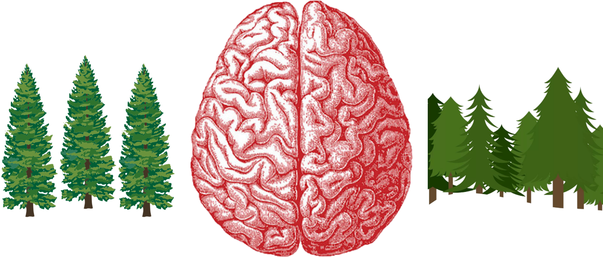

```{r setUp, echo=FALSE, include=FALSE}
  knitr::opts_chunk$set(echo = FALSE)
  knitr::opts_chunk$set(message = FALSE)
  knitr::opts_chunk$set(warning = FALSE)
  
  if(params$genFigs) source("R/SetUp.R")
```


<section class="titleslide level1">

<h1>At a time when slide rules roamed the land...</h1>

<p class="fragment fade-up" data-fragment-index="0">
  ...one man, 
	<span class="fragment strike-red" data-fragment-index="1">Jon</span><span 
		class="fragment insert-right" data-fragment-index="1">John</span>
	Snow, would dare to visualize...
  
  
</p>


<p class="fragment fade-up" data-fragment-index="3">
  ...and change public health *forever*...
</p>

## Plots in the Time of Cholera

{style="max-width:65%; max-height:65%"}
</section>

-------------------------------------------------------------------------------

<section class="titleslide level1">
<h1>If You're Looking For Advice</h1>


<aside class="notes">
  Obligatory Meme - There is no shortage of people willing to tell you what to do. Here's just a few.
</aside>

## Some References

* Berinato, Scott. “Data Science and the Art of Persuasion.” *Harvard Business Review*, January-February 2019, pp. 126–137, http://hbr.org/2019/01/data-science-and-the-art-of-persuasion.
* Berinato, Scott. *Good Charts: the HBR Guide to Making Smarter, More Persuasive Data Visualizations*. Harvard Business Review Press, 2016.
* Brinton, Willard Cope. *Graphic Methods for Presenting Facts*. Engineering Magazine Company, 1919.
* Chen, Chun-houh, et al. *Handbook of Data Visualization*. Springer, 2016.
* Cleveland, William S. *The Elements of Graphing Data*. AT&T Bell, 1994.

<aside class="notes">
  * A book from Harvard so you know it's good
  * Going real old school with Brinton
  * Compliation, so even more bang for your buck
</aside>

## Some More

* Cook, Dianne, and Deborah F. Swayne. *Interactive and Dynamic Graphics for Data Analysis with R and GGobi*. Springer Science+Business Media, LLC, 2008.
* Dzemyda, Gintautas, et al. *Multidimensional Data Visualization: Methods and Applications*. Springer Science+Business Media, 2013.
* Ellis, Laura. “Little Miss Data - Weird Graphs.” *Little Miss Data*, http://www.littlemissdata.com/search?q=weird%20graphs.
* Healy, Kieran. *Data Visualization: A Practical Introduction*. Princeton University Press, 2019.

<aside class="notes">
  * A blog...typical millennials
</aside>

## Even More

* Huff, Darrell, and Irving Geis. *How to Lie with Statistics*. W.W. Norton & Co., 2006.
* Lidwell, William, et al. *Universal Principles of Design: 125 Ways to Enhance Usability, Influence Perception, Increase Appeal, Make Better Design Decisions, and Teach through Design*. Rockport, 2010.
* Postman, Neil. *Amusing Ourselves to Death: Public Discourse in the Age of Show Business*. Simon Fraser University, 2007.
* “Results - The Visual Display of Data.” *Biomedical Research: How to Plan, Publish, and Present It*, by W. F. Whimster et al., Springer, 1997, pp. 70–93.

<aside class="notes">
  * sprinkling in some design principles
</aside>

## Yet Still More

* Schwab, Pierre-Nicolas. “Big Data and Ethics: How Visualization Can Screw It Up.” *Into the Minds*, http://www.intotheminds.com/blog/en/big-data-and-ethics-how-visualization-can-screw-it-up/.
* Sen, Amit. “Visual Thinking: The New Business Language.” *Engadget*, http://www.engadget.com/2016/12/14/visual-thinking-the-new-business-language/.
* Sula, Chris Alen. “The Ethics of Visualization.” *Chris Alen Sula*, http://chrisalensula.org/the-ethics-of-visualization/.
* Sunstein, Cass R., and Richard H. Thaler. *Nudge: Improving Decisions about Health, Wealth and Happiness*. Penguin, 2009.

<aside class="notes">
  * some more blog, since this is a talk about digitalization after all
  * make sure you get some ethics in there
  * behavioral economics and visualization aren't that unrelated; plus he is a Nobel laureate
</aside>

## One More 'More'
* Tufte, Edward Rolf. *The Visual Display of Quantitative Information*. Graphics Press, 2015.
* Wickham, Hadley. “A Layered Grammar of Graphics.” *Journal of Computational and Graphical Statistics*, Vol. 19, No. 1, 2010, pp. 3–28., doi:10.1198/jcgs.2009.07098.
* Wilke, Claus O. *Fundamentals of Data Visualization: A Primer on Making Informative and Compelling Figures*. O'Reilly Media, 2018.
* Wilkinson, Leland. *Grammar of Graphics*. Springer, 2012.
* Zhu, Ying. “Measuring Effective Data Visualization.” *Advances in Visual Computing Lecture Notes in Computer Science*, Part III, 2007, pp. 652–661., doi:10.1007/978-3-540-76856-2_64.

<aside class="notes">
  * A classic with the first one
  * Grammar of Graphics is a real page turner
  * And a few journal articles for the academic types
</aside>

</section>

-------------------------------------------------------------------------------
<h1>Be Purposeful</h1>
<section class="titleslide level1" data-background-color="#586638">
## Philosophical Considerations

{class="noframe"}

<aside class="notes">
  * Not left and right brain as logical vs creative
  * Iain McGilchrist describes it differently
    + left as narrowly, detailed focused
    + right as broadly, vigilant 
  * Use both, but use an analogy
  * Visualizations bridge individual results to trends
  * Management/reviewers don't know all the details of your experiment 
</aside>

## Pragmatic Considerations

```{r SPC}
  if(params$genFigs) source("R/RunCharts.R")
```


<span class="fragment disappear" data-fragment-index="1")>
  
</span>


<aside class="notes">
  * Remember what you are trying to assess
  * don't become distracted
  * If it's a statistical control chart, don't put on specs. 
    + Use a histogram
</aside>

</section>

-------------------------------------------------------------------------------
<h1>Be Deliberate</h1>
<section class="titleslide level1" data-background-color="#2288a8">

<aside class="notes">
  * Data only speaks for itself with the voice you give it.
</aside>

## Elementary Graphical-Perception Tasks (Cleveland 1985)

<div class="row">
  <div class="column", style="font-size: 90%">
  1. Position Along Common Axis
  1. Position on Identical, Nonaligned Scales
  1. Length
  1. Angle
  1. Slope
  1. Area
  1. Volume/Density/Color Saturation
  1. Color Hue
  </div>
  
  <div class="column">
  
  <span class="fragment disappear" data-fragment-index="0">
  <br>
  </span>
  <span class="fragment appear" data-fragment-index="0">
  <br><span class="fragment disappear" data-fragment-index="1">
  
  </span></span>
  <span class="fragment appear" data-fragment-index="1">
  
  </span>
  <span class="fragment appear" data-fragment-index="2">
  
  </span>
  <span class="fragment appear" data-fragment-index="3">
  
  </span>
  
  </div>

<aside class="notes">
  * One consideration
  * Other design principles
    + optimize data to ink ratio
    + accessibility (color blindness)
    + aesthetic-usability effect
      - review vs. final
</aside>

</section>

-------------------------------------------------------------------------------
<h1>Be Consistent</h1>
<section class="titleslide level1"" data-background-color="#ecbd8b">

<aside class="notes">
  * Branding has it purpose
  * Also want to help the view asorb the data
</aside>

## Not Every Plot Deserves Its Own Theme


<aside class="notes">
  * Don't make your reader constantly relearn mappings
  * Prefer the minimal, but keep to norms
    + Yellow and green aren't actually bad
</aside>

</section>

-------------------------------------------------------------------------------
<h1>Then There Was Excel...</h1>
<section class="titleslide level1">
  
<aside class="notes">
  * Excel chart wizard allowed us to make visualizations faster and easier than before
  * But instead of using this to perfect visualizations, we used it to bypass design
</aside>

-------------------------------------------------------------------------------
{style="border: 0px; width: 607px; height: 328px" alt="These defaults are not ok..."}
<div style="font-size: 1.5em;">*"That's an appropriate <br>use of a 3D bar chart"*</div>
<div style="font-size: 1.25em" class="fragment fade-up">---No One Ever</div>
<aside class="notes">
  Plenty of tirades just a Google search away, but a quote that's sort of the epitome of my , let's say, objections
  
  * Gray flood fill is just excess ink
  * Generally against grid lines
  * Perspective unnecessary and misleading - the values are 1:5
</aside>

</section>

-------------------------------------------------------------------------------
<h1 class="darkoutline">Welcome to a Digital World</h1>
<section class="titleslide level1" data-background="img/binary-globe.jpg">

<aside class="notes">
  * Excel can do many things
    + And be do use it for many things
    + We just don't tend to use it for what it's good at (data entry, reactive programming)
    + Recent years have brought explosion of new/better digital tools 
  * Excel was a large step forward, and mainly exhibited first digitalization benefit
</aside>

</section>

-------------------------------------------------------------------------------

<section class="titleslide level1">

<h1>Digital Production</h1>

<aside class="notes">
  * Two Approaches Enter, One Approach Leaves
  * Digital Visualizations are inherently Digitally Produced
  * Not just digital producing static assets
  	+ e.g. digital printing has helped with late stage customization
  	+ think type setting vs. printers as we know them now
  * Digital Production has it's pitfalls
  	+ Where we need to remember our design principles
  * Digital Visualizations have more capabilities/advantages
  	+ Requires viewing on a digital medium
  	+ Sets the stage for reproducibility, traceability, automatic updates
</aside>

</section>

-------------------------------------------------------------------------------

<section class="titleslide level1">
<h1>The Digital Triad of Power</h1>

<aside class="notes">
  Taken from Thomas Lin Pedersen
  
  * Static Viz
  * Interactive Viz
  * Motion Viz
</aside>

## Static Digital Visualizations

<aside class="notes">
  * Different formats - SVG allows scaling (first principles of visualizations)
  * Transferable (send a link not copy)
  * Include by Reference (need to discussion around data integrity)
  * Combinations
</aside>

## Interactive Visualizations

## Motion Visualizations

## Multi-Modal

</section>

-------------------------------------------------------------------------------

<section class="titleslide level1">
<h1>Not Just For Camping Equipment</h1>

<div class="row">

  <div class="column" style="text-align: left; padding: 7vw 0 0 0; font-size: 155%;">
  
  <i class="fragment insert-right far fa-clone" data-fragment-index="0"></i> 
  <span class="faText"> R 
  <span class="fragment insert-left" data-fragment-index="0">- Reproducible
  </span></span>
  
  <i class="fragment insert-right fas fa-expand-arrows-alt" data-fragment-index="1"></i>
  <span class="faText"> E 
  <span class="fragment fade-left" data-fragment-index="1">- Extensible
  </span></span>
  
  <i class="fragment insert-right fas fa-network-wired" data-fragment-index="2"></i>
  <span class="faText"> I 
  <span class="fragment insert-left" data-fragment-index="2">- Integratable
  </span></span>
  
  </div>
  
  <div class="column">
  
  <i class="fas fa-campground fragment disappear" style="font-size: 800%; padding: 7vw 0 0 0; "data-fragment-index="2"></i>
  <i class="fas fa-laptop-code fragment appear" style="font-size: 800%; padding: 7vw 0 0 0;" data-fragment-index="2"></i>
  
  </div>
  
</div>

<aside class="notes">
Need an acronym, after all this is a pharma conference<br>
Sets the stage (not inherent) for

  * Reproducible research and reports 
    + Automated or real time updates
    + Traceability
  * Extensibile 
    + Beauty of open source
    + Different views, same content
  * Integratable (creating this word)
    + Google Lighthouse, Analytics (mobile app), git 
    + Reusable (iframe)
    + Scripts to assess data integrity/GxP practices?
  
</aside>

</section>

--------------------------------------

<section class="titleslide level1" data-background="img/Star-Sky.jpg">

<blockquote class="single-quote" style="text-shadow: 2px 2px 2px #000000; background: rgba(255, 255, 255, 0.2);">
Computers have enabled people to make more mistakes faster than almost any invention in history, with the possible exception of tequila and handguns.<br>
--- Mitch Ratcliffe
</blockquote>

<aside class="notes">

  * Start With Design Principles
  * Move Beyond Excel Defaults
  * Expand Use of Digital Media
  
</aside>

</section>

--------------------------------------

<section class="titleslide level1" data-background="img/Star-Sky.jpg">

<div style="text-align: left; padding: 4em 0 0 0;">
  <h2>Marcus Adams</h2>
  <h4>Blog (coming soon):
    <a href="datainprogress.com/blog">datainprogress.com</a>
  </h4>
  <h4>Twitter:
    <a href="https://twitter.com/mtotheadams">@MtotheAdams</a>
    </h4>
  <h4>Github: 
    <a href="https://github.com/adamsma">github.com/adamsma</a>
  </h4>
  <h4>Slides: 
    <a href="https://adamsma.github.io/FDAPQRI2019/">adamsma.github.io/FDAPQRI2019/</a>
  </h4>
</div>
</section>